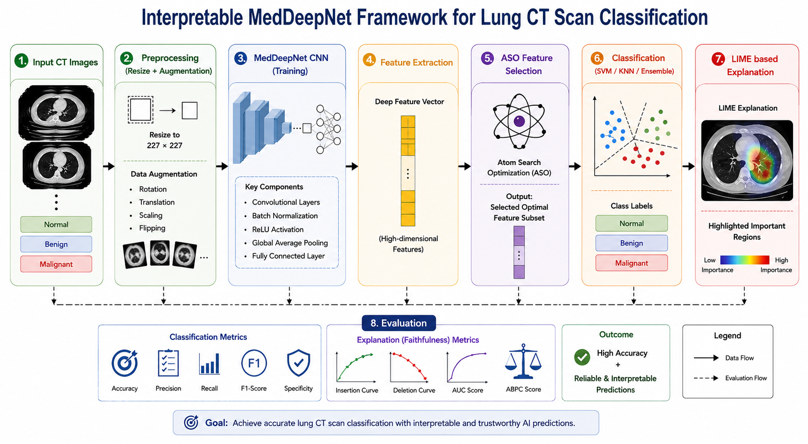
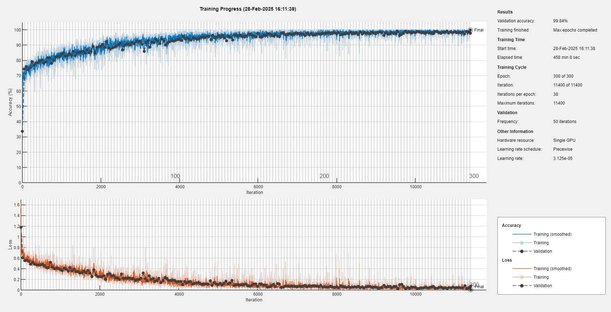
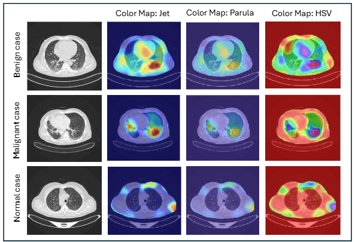

  

## Interpretable-MedDeepNet-Model

This repository presents the implementation of an Interpretable MedDeepNet framework for lung CT scan classification and explainable artificial intelligence (XAI)-based decision interpretation. The proposed framework integrates deep learning, feature selection, and model-agnostic explanation techniques to improve both classification performance and interpretability in medical image analysis.

The pipeline is designed for automated lung disease classification using CT scan images, covering three categories: normal, benign, and malignant cases. A MedDeepNet is first trained to extract discriminative features from medical images. These features are then optimized using Atom Search Optimization (ASO) for improved feature selection and classification performance.

To enhance transparency and clinical trust, the framework incorporates LIME-based explainability methods, which generate local, interpretable visual explanations highlighting the most influential regions in the image contributing to the model’s prediction.

This repository provides a complete and reproducible pipeline for lung CT image classification, combining high-performance deep learning with interpretable AI techniques suitable for medical decision-support systems.

## Key Features
- MedDeepNet for lung CT classification
- preprocessing pipeline
- Feature extraction using a trained MedDeepNet
- Atom Search Optimization (ASO) for feature selection
- Machine learning-based classification (SVM, KNN, etc.)
- LIME-based interpretable model explanations
- Performance metrics for explanation evaluation

## Dataset
The dataset consists of lung CT scan images with three classes:
- Benign
- Malignant
- Normal

Download the dataset from:
[[link](https://www.kaggle.com/datasets/hamdallak/the-iqothnccd-lung-cancer-dataset)]

Users should organize the dataset as:
dataset/
   original/
   resized_augmented/
   segmented/

## How to Run

Run scripts in the following order:

1. preprocess_pipeline.m
2. train_meddeepnet.m
3. feature_extraction.m
4. feature_selection.m
5. classification.m
6. lime_base_explanation.m

## Experimental Settings

### Software Specifications
- MATLAB R2024a
- Deep Learning Toolbox
- Computer Vision Toolbox
- Image Processing Toolbox
- Statistics and Machine Learning Toolbox

### MedDeepNet Configuration
- Optimizer: SGDM
- Learning Rate: 0.001
- Batch Size: 128
- Max Epochs: 300
- Momentum: 0.9
- Learning Rate Schedule: Piecewise
- Drop Factor: 0.5 every 50 epochs
- L2 Regularization: 1e-4
- Execution: GPU

### ASO Configuration
- Population Size: 10
- Max Iterations: 25
- α = 50
- β = 0.2
- Objective: Feature Selection

## Results
- High classification accuracy achieved using MedDeepNet
- LIME-based explanation provides interpretable visual explanations
- Evaluation includes insertion and deletion metrics for faithfulness analysis
  

  

  

  <a>Figure: Model accuracy and loss curve</a>

  

  <b>Figure: Visual explanations using different color maps, highlighting regions influencing model predictions</b>

- ## Citation
If you use this code, please cite the related paper:

@article{MedDeepNet2026,
  title={Interpretable MedDeepNet: Deep Feature Learning with Atom Search Optimization for Explainable Lung Cancer Detection in CT Images},
  author={Shahab Ul Hassan et al.},
  year={2026}
}
